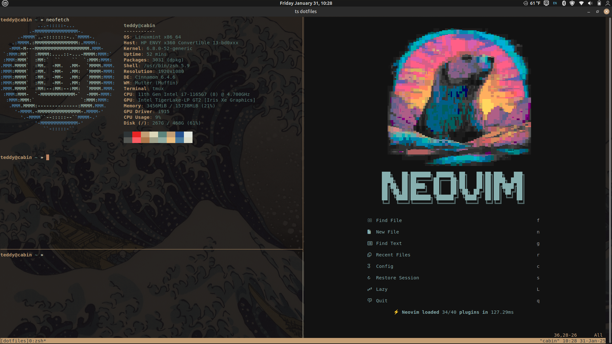

## Personal Space

Welcome to my personal corner of the web where I share my journey, aspirations, and setup.

### 🎯 Goals

#### Short Term
- Programming
  - Become highly proficient in programming with Rust
- Fitness
  - Run 10 mi/week (16 km/week) as baseline (doesn't interfere with other activities)
- Biking:
  - Whiterim, Canyonlands, UT \| 100 mi (160 km), bikepacking
  - Whole Enchilada, Moab, UT \| 34 mi (55 km), downhill
  - Kokopelli Trail, Moab, UT \| 150 mi (240 km), bikepacking

#### Long Term
- Read everyday.
- Start a PhD or graduate with a M.S.

### 🚀 Current Endeavors

#### Learning Rust
I am currently reading _The Rust Programming Language_ book. I am currently on Chapter 11. I have also committed to doing all of my numerical analysis homework in Rust to help me learn.

#### Fitness
I am going to crossfit classes about 4-5x/week. I am working on building mass and increasing my threshold for cardio and work output.

Also trying to build a baseline for running. Currently, I am running 6 miles per week. I am focusing on developing the ability to _move constantly_ with _minimal recovery time_. In general, I hope to be able to run medium distances and not feel the need to recover or let it get in the way of other more strenuous activities like BJJ, climbing, biking, etc.

### 📝 Notes

#### Reading List
- _The Wager_ by David Grann.
- _Call of the Wild_ by Jack London.

### 💻 My Setup

#### Development Environment
Here's my current development setup that helps me stay productive. I use [tmux](https://github.com/tmux/tmux/wiki) with [Neovim](https://neovim.io/). 


*My current terminal and text editor configuration*

You can check out my [neovim](https://github.com/abarton51/kickstart.nvim) configuration or my [dotfiles](https://github.com/abarton51/dotfiles) (work in progress).

I used [kickstart.nvim](https://github.com/nvim-lua/kickstart.nvim) as my _kickstart_ to using Neovim. I can't recommend it for beginners enough. It's just enough to get you started, the documentation is super helpful, and it's still highly configurable and customizable.

---

*Last Updated: [01/31/2025]*
```

